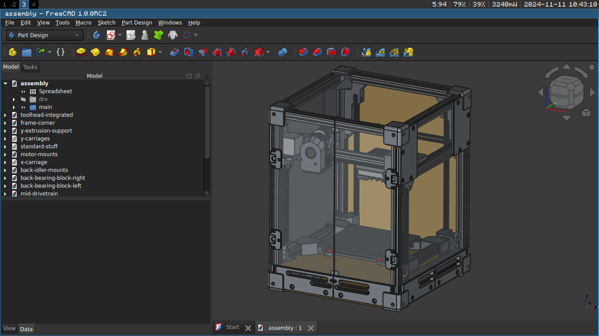

# corexy vslot 3d-printer

Corexy is not only useful because of the low moving mass, but also because of the compact
and easily enclosable form factor, but all the popular diy printers that use it are kind of
expensive.
So I designed a corexy 3d printer that uses v-wheels to make it cheap.
When built with v-wheels for all the axes, the parts, including the raspberry pi,
cost around 210Eur. When built with mgn9 linear rails for x and y, it costs around 30 Eur more.
The build volume is (180mm)^3 but there may be a bigger version (220mm)^3 in the future.

## design decisions
- 2020 extrusions
This printer uses 2020 aluminium v-slot extrusions because they are cheap and versitile.
They allow you to mount anything to them easilly with T-nuts and can be solidly
connected to each other using blind joints.
One downside though is that for a straight connection they need to be cut very precisely at a 90deg angle.

- enclosure
The panels are designed to be lasercut.
The front, side and top enclosure panels are made from 4mm transparent acrylic.
The bottom and back panels are made from 5mm hdf(high density fiberboard) or any other 5mm panel.

- corexy motion system
In a corexy motion system the motors do not move which reduces the moving mass.
This enables higher accelerations as moving mass creates ringing effects which would degrade
the print quality meaning a higher print speed can be achieved.
Also, because there is no moving bed, corexy printers can have a very compact enclosure.

- v-wheels
V-wheels are cheaper than linear rails but might not be as durable/reliable in the long run.
That is why this printer can be built with linear rails for the x and y axes which experience
the most movement.

- bed is supported on 4 corners
This ensures that the bed is moving perpendicular to the xy-plane reliably.

- 1 stepper for z
This not only saves on stepper motor costs but also enables the use of mainboards
with only 4 stepper drivers which are cheaper.

- minimal toolhead
because the voron stealthburner toolhead is too big, the mini stealthburner doesn't have
good enough cooling and the dragonburner requires a seperate (expensive) extruder,
This printer has it's own toolhead using BMG extruder gears and a bambulab clone hotend.

- frame corners
Aluminium extrusions can twist when tightening down blind joints which can be prevented
by 3d printed corner pieces which also protect the enclosure panels.
This makes the build easier and improves portability and durability.

- stationary gantry
the xy-gantry is stationary as this is more compact than a flying gantry.

## CAD software
This project uses FreeCAD. All the CAD files are in the CAD folder.
Currently there are no plugins you need to install to open any of the CAD files.
There is one main assembly file where all the parts of the printer are integrated.
You can't just download the assembly.FCStd file because it uses links to integrate all the other
sub-assemblies or parts from the other files. You have to download the whole repository (or the CAD folder)
in order to open the main assembly file.
